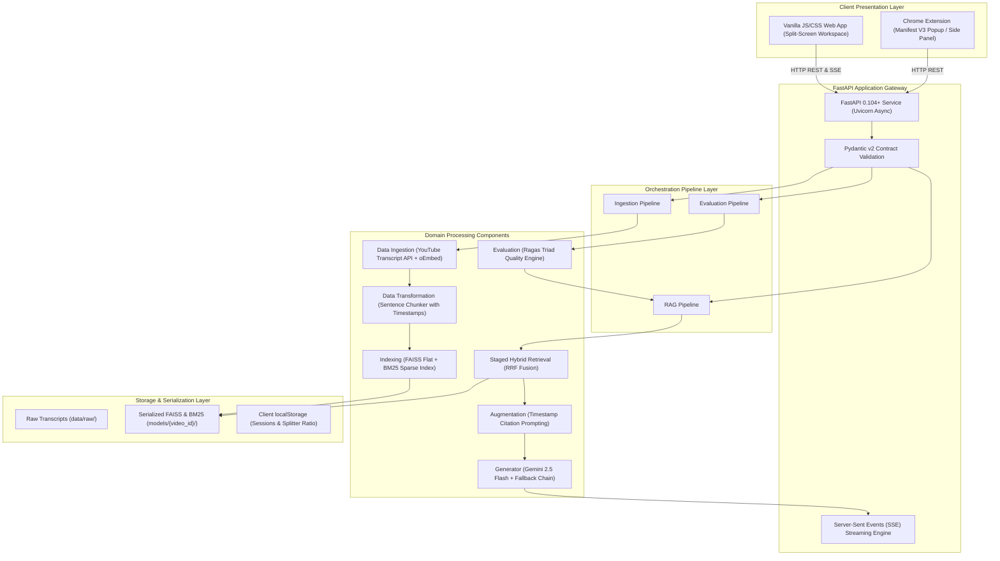
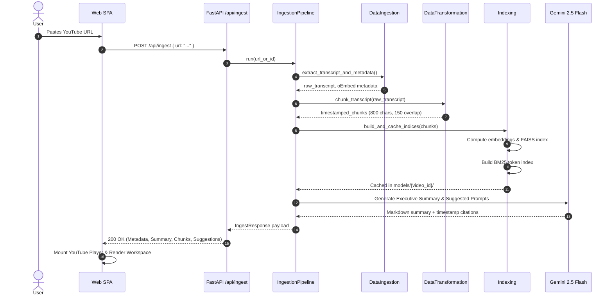
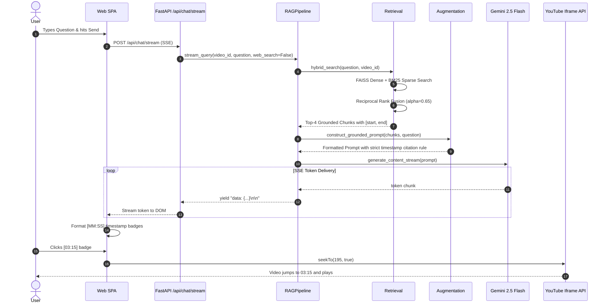

# System Architecture & Technical Design

## YouTube Chatbot 2.0: Multimodal RAG Pipeline & Topology

---

### 1. High-Level Architecture Overview

The YouTube Chatbot platform is architected as an end-to-end Machine Learning system engineered for low latency, factual grounding, and verifiable multimodal context extraction. The system adopts a **Staged Hybrid Retrieval-Augmented Generation (RAG)** topology that merges dense vector semantic search with sparse lexical keyword matching.



---

### 2. Architectural Layers

#### 2.1 Client Presentation Layer
- **Vanilla ES6 Single Page Application (`app/static/`)**:
  - Implements the 4-Color Obsidian Design System (`#09090b` Obsidian, `#ffffff` White, `#ff0033` YouTube Red, `#10b981` Emerald).
  - Synchronizes with the official **YouTube Iframe API**, handling programmatic seeking, playback control, and temporal state tracking.
  - Controls a responsive **Draggable Splitter** that allows users to redistribute viewport width between media context and chat history.
  - Persists all conversation sessions, metadata, and workspace ratios in browser `localStorage`.
- **Manifest V3 Browser Extension (`extension/`)**:
  - Injects lightweight scripts into active YouTube video tabs.
  - Extracts the active video ID from the browser tab and queries the local or hosted API server directly from a popup or side panel.

#### 2.2 API and Gateway Layer (`app/api.py`)
- **FastAPI Core**:
  - Built on top of Starlette and Uvicorn, providing high-concurrency asynchronous I/O.
  - Configured with CORS middleware to allow seamless requests from Chrome extension origins (`chrome-extension://*`) and local development ports.
- **Streaming Architecture**:
  - Employs Server-Sent Events (SSE) via Starlette's `StreamingResponse` on `/api/chat/stream`.
  - Streams tokens incrementally as they are produced by the LLM, reducing perceived time-to-first-token (TTFT) to under 800 milliseconds.

#### 2.3 Domain Component Layer (`src/components/`)
The core domain logic is decoupled into single-responsibility components:

| Component | Class / Module | Primary Responsibility |
|---|---|---|
| Ingestion | `DataIngestion` | Extracts subtitles via `youtube_transcript_api` and metadata via YouTube oEmbed |
| Validation | `DataValidation` | Validates transcript length, character distributions, and video ID structure |
| Transformation | `DataTransformation` | Chunks transcripts into 800-character windows preserving precise start/duration times |
| Indexing | `Indexing` | Constructs and caches FAISS dense vector indices and BM25 sparse lexical indices |
| Retrieval | `Retrieval` | Implements Staged Hybrid Filtering and Reciprocal Rank Fusion (RRF) |
| Augmentation | `Augmentation` | Injects retrieved timestamped chunks into grounded prompt templates |
| Generation | `Generator` | Manages Google GenAI client with fallback chains (`gemini-2.5-flash` -> `gemini-1.5-flash`) |
| Evaluation | `Evaluation` | Computes Faithfulness, Answer Relevancy, Context Precision, and Context Recall |

---

### 3. Staged Hybrid Retrieval Topology

A fundamental flaw in standard naive RAG systems is semantic drift: vector similarity often retrieves chunks that discuss related concepts but miss the exact keyword, number, or entity requested by the user. Conversely, pure keyword search fails when users phrase questions using synonyms.

YouTube Chatbot solves this using a **3-Stage Hybrid Retrieval Pipeline**:

```
Query Input
    │
    ▼
┌────────────────────────────────────────────────────────┐
│ Stage 1: Metadata Pre-Filtering                       │
│ - Scope candidate chunks strictly to active video_id   │
│ - Purge empty, degenerate, or corrupted segments       │
└────────────────────────────────────────────────────────┘
    │
    ▼
┌────────────────────────────────────────────────────────┐
│ Stage 2: Hybrid Search & Reciprocal Rank Fusion (RRF)  │
│                                                        │
│   Dense Vector Search            Sparse Lexical Search │
│   (FAISS: text-embedding-004)    (Rank-BM25: Okapi)    │
│            │                              │            │
│       Dense Ranks                    BM25 Ranks        │
│            └──────────────┬───────────────┘            │
│                           ▼                            │
│           Reciprocal Rank Fusion (RRF)                 │
│         Score = 0.65 * Dense + 0.35 * BM25             │
└────────────────────────────────────────────────────────┘
    │
    ▼
┌────────────────────────────────────────────────────────┐
│ Stage 3: Contextual Compression & Deduplication        │
│ - Filter chunks below similarity threshold (0.30)      │
│ - Eliminate adjacent duplicate timestamp windows       │
│ - Select Top-4 highest-yield context chunks            │
└────────────────────────────────────────────────────────┘
    │
    ▼
Synthesized Context injected into Prompt
```

#### Reciprocal Rank Fusion (RRF) Formulation
Given a set of candidate documents $D$, the hybrid score for each document $d \in D$ is computed as:

$$RRF\_Score(d) = \alpha \cdot \frac{1}{k + Rank_{dense}(d)} + (1 - \alpha) \cdot \frac{1}{k + Rank_{bm25}(d)}$$

Where:
- $k = 60$ (smoothing constant preventing high ranks from dominating the distribution)
- $\alpha = 0.65$ (empirically tuned weight prioritizing semantic dense context while retaining lexical precision)
- $Rank_{dense}(d)$ is the 1-based rank from FAISS similarity
- $Rank_{bm25}(d)$ is the 1-based rank from BM25 scoring

---

### 4. End-to-End Sequence Workflows

#### 4.1 Ingestion & Vector Construction Sequence



#### 4.2 Conversational Retrieval & Token Streaming Sequence



---

### 5. Storage & Persistence Architecture

1. **In-Memory & Disk Vector Serialization (`models/{video_id}/`)**:
   - `index.faiss`: Binary serialized FAISS index containing 384-dimensional vector embeddings.
   - `index.pkl`: Serialized metadata mapping vector indices to chunk dictionaries (text, start time, end time, video ID).
   - `bm25.pkl`: Serialized BM25 Okapi model containing token frequencies and inverted document lists.
2. **Raw Data Cache (`data/raw/` & `data/processed/`)**:
   - Raw extracted transcripts stored as JSON payloads (`{video_id}_raw.json`), preventing redundant calls to YouTube subtitle APIs.
3. **Browser Local Storage (`localStorage`)**:
   - `yt_copilot_agent_sessions_v2`: Serialized array of session objects containing chat history, video metadata, active tabs, and generated summaries.
   - `yt_copilot_active_session_id_v2`: Active session UUID pointer.
   - `yt_copilot_media_col_ratio_v2`: Floating-point width ratio of the split-screen workspace, persisting user layout custom preferences.

---

### 6. Resilience, Scalability & Security

- **LLM Fallback Topology**: Primary calls target `gemini-2.5-flash`. In the event of Google Cloud 429 (Resource Exhausted) or 503 (Service Unavailable) status codes, the generator automatically switches to `gemini-1.5-flash` without terminating user conversations.
- **Resource Profiling**:
  - Memory consumption per active index is under 5MB.
  - FAISS CPU search across typical video transcript lengths (100 - 800 chunks) executes in under 8 milliseconds.
- **Zero Ingestion Leakage**: Subtitle extraction uses unauthenticated public scraping and oEmbed endpoints, eliminating API quota constraints on YouTube Data API keys.
